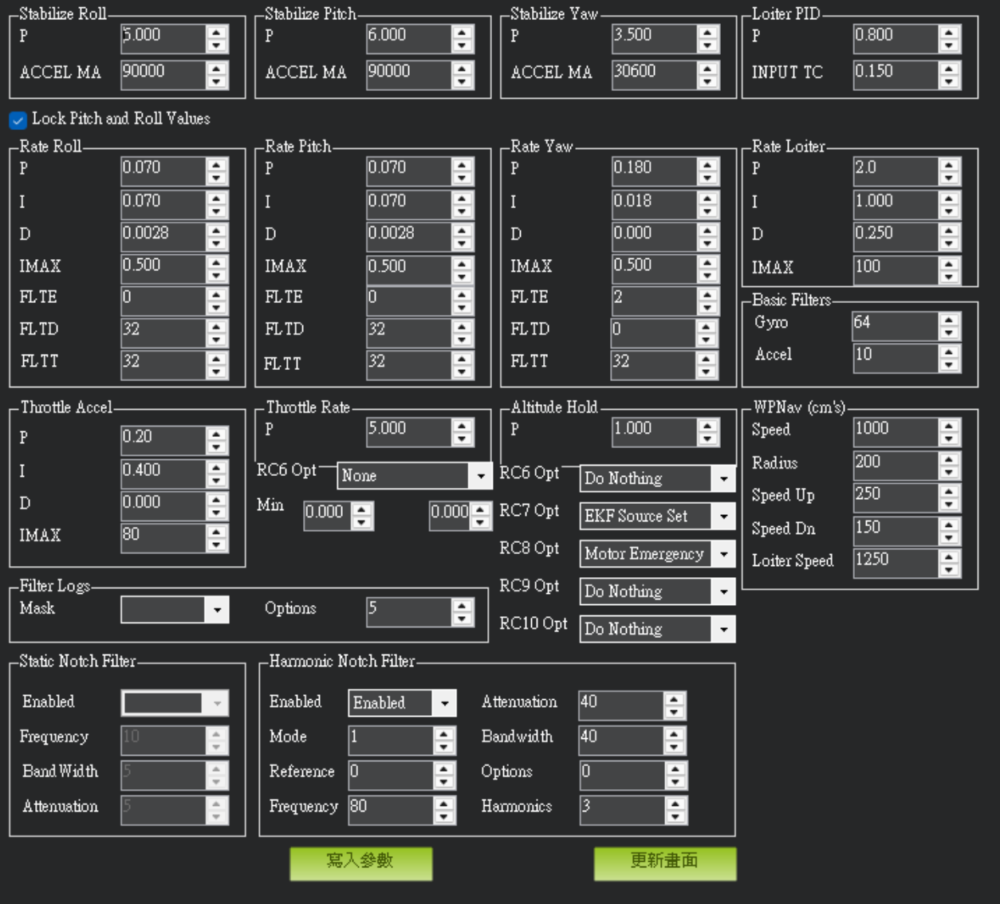

# Ardupilot調機指南

<figure><figcaption></figcaption></figure>

#### 一、 PID 控制器背景與組成

ArduPilot 的**PID-FF-DFF 控制器** 來確保無人機的飛行性能。完整的控制器包含五個主要部分：

* **P (Proportional) 比例項**：對當前誤差做出反應。
* **I (Integral) 積分項**：補償外力（如風）帶來的長期誤差，保持速度與姿態。
* **D (Derivative) 微分項**：抑制加速度的過衝，起到阻尼作用。
* **FF (Feed Forward) 前饋項**：直接根據指令預測輸出。
* **DFF (Derivative Feed Forward) 導數前饋項**。

<figure><figcaption></figcaption></figure>

**建議的調整順序為：D -> P -> I -> DFF -> FF**。

**注意，調整時最好為每一軸分開調整，例如：調Roll軸時只動Roll軸參數**

***

#### 二、 調整前的準備工作

一般建議直接用Mission Planner提供的快速計算工具，輸入你使用的飛機配置即可大概估算起始PID值

<figure><figcaption></figcaption></figure>

1. **初始參數(Initial Tune Parameter)設置**：在「初始配置」中設置螺旋槳尺寸、電池節數及電壓，Mission Planner會計算出適合的參數，直接寫入即可。
2. **日誌記錄設置**：正確的日誌對調參至關重要。建議設置 `INS_LOG_BAT_OPT = 5`，並將樣本計數設為 1024 或 2048。
3. **飛行模式**：調整應在 **Stabilize (自穩)** 或 **AltHold (定高)** 模式下進行，**嚴禁在 Loiter 模式下進行初步調參**。

***

#### 三、 內環-速率 PID 調整 (Rate Controller)

這是底層控制的核心，包含橫滾 (Roll)、俯仰 (Pitch) 與偏航 (Yaw) 三個控制器。

<figure><figcaption></figcaption></figure>

**1. P:D 平衡調整**

目標是讓實際轉速曲線與目標曲線完美重疊。

* **D 項調整**：以 30% 的步長增加 D，直到觀察到短促的振盪，然後以 10% 步長減小直到振盪消失，最後再減少 25%。
* **P 項調整**：以 30% 步長增加 P，直到出現快速小幅度的振動，再以 10% 步長減小直到消失，最後再減少 25%。
* **表現判斷**：
  * **P 過高**：高頻振盪抖動；**P 過低**：響應緩慢，容易受風干擾晃動。
  * **D 過高**：會放大噪聲，導致電機震動、金屬嘯叫或發熱嚴重；**D 過低**：階躍輸入後會出現明顯過衝。

**2. 絕對增益與 P:I 平衡**

* **整體增益**：找到 P:D 平衡後，可以將 P、I、D 以相同倍數增加，直到出現振盪再回落 10-20%。
* **I 項調整**：I 增益太高會看到緩慢的振盪；太低則會導致打桿後姿態回中延時增加。
* **一般經驗值**：對於俯仰和橫滾，P 和 I 通常相等，D 約為 P 的 1/10；對於偏航，通常不需要 D 項 (D=0)，I 約為 P 的 1/10。

***

#### 四、 外環-姿態（穩定）控制調諧 (Attitude Controller)

在速率 PID 調整良好後，才進行姿態控制調整。這是一個比例 (P) 控制器，控制目標角度與實際角度的轉換。

<figure><figcaption></figcaption></figure>

* **調整方法**：在「擴展調整」中增加 **姿態 P 項**，直到開始出現振盪，然後回落約 20%。
* **最大傾斜角度**：通常建議設置 `ANGLE_MAX = 30`（30度），以確保在最大傾斜時仍有足夠推力維持高度。

***

#### 五、 油門與高度 PID 調整 (Throttle PID)

油門控制器控制垂直加速度與高度。

<figure><figcaption></figcaption></figure>

1. **學習懸停油門**：在 AltHold 模式下穩定懸停 30 秒，讓系統學習 `MOT_THST_HOVER`。若該值小於 0.3，建議將 `ATC_THR_MIX_MAX` 設為 0.9。
2. **加速度補償**：
   * 設置 `PSC_ACCZ_I` 為懸停油門的 3 倍。
   * 設置 `PSC_ACCZ_P` 為懸停油門的 1.5 倍。
3. **垂直位置控制**：調整 `PSC_POSZ_P` 以更積極地跟蹤高度，但過高會導致過衝或振盪。

***

#### 六、 位置保持調整 (Loiter/Position Control)

<figure><figcaption></figcaption></figure>

1. **水平位置控制**：`PSC_POSXY_P` 將位置誤差轉換為目標速度。
2. **水平速度控制**：`PSC_VELXY_P、I、D` 將目標速度轉換為加速度。
3. **運動參數調整**：
   * **LOIT\_SPEED**：設置 Loiter 模式下的最大速度。
   * **PSC\_JERK\_XY**：增加此值可讓水平控制響應更快速，但過高會讓飛行顯得過於激進。

***

#### 七、 常見的數值化調整方法

* 開啟Mission Planner，選擇最下方的**舵機調整**
*

    <figure><figcaption></figcaption></figure>
*   在圖表上點兩下，根據想要調整的軸選擇要看的軸，在此以Pitch為例

    <figure><figcaption></figcaption></figure>
* 實際飛行時，觀察兩條線是否貼合，如果非常貼合表示PID狀態很好，如果pitch.target範圍大於實際pitch，可能表示Rate P可能不足，此時應該增加Rate P與Rate I，並多次調整與測試直到兩條線貼合，才表示該PID軸已調整完畢
