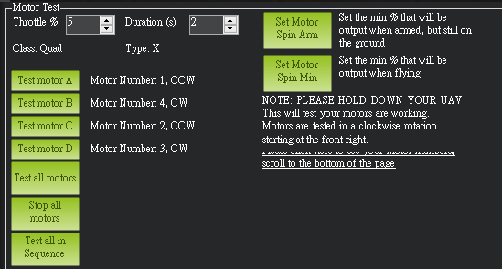

# 首次設定First Setup

首次設定時，必須配置與校正一些硬體配件以及參數，並依據以下順序執行：

1. 選擇框架方向(Frame Type)
2. 馬達編排與轉向(Motor Numbering and Direction)
   1. Ardupilot
      1. 開啟DShot設定，變更完重新啟動才會生效
         1. SERVO\_DSHOT\_ESC = 3
         2. MOT\_PWM\_TYPE=6(DSshot-600)
      2.  馬達測試，測試方向與馬達位置是否正確，

          <figure><figcaption></figcaption></figure>

          1.
          2.

              <figure><figcaption></figcaption></figure>

          3. 如果旋轉的位置錯誤，則更改馬達順序
             1.

                 <figure><figcaption></figcaption></figure>
          4. 如果選轉方向錯誤，更改SERVO\_BLH\_RVMASK，變更完重新啟動才會生效
             1.

                 <figure><figcaption></figcaption></figure>
   2.
3. 配置與校正遙控器(RC Calibration)
4. 加速度計校正(Accelerometer Calibration)
5. 磁羅盤校正(Compass Calibration)
6. 電子變速器(電變, ESC)校正
7. 故障保護機制設定(Failsafe)
8. 飛行模式設定(Flight Mode)

除了強制校準外，還可以選擇配置周邊硬體設備，包括但不限於：

1. 電池監視器(Battery Monitor)
2. 聲納(Sonar Range)
3. 空速計(Airspeed sensor)
4. 光流(Optical flow)
5. OSD
6. 相機雲台(Gimbal Camera)

***

#### 此教學所示範的系統與接線如下：

*

#### 以下將會示範Betaflight、Ardupilot、PX4韌體的首次設定



*










