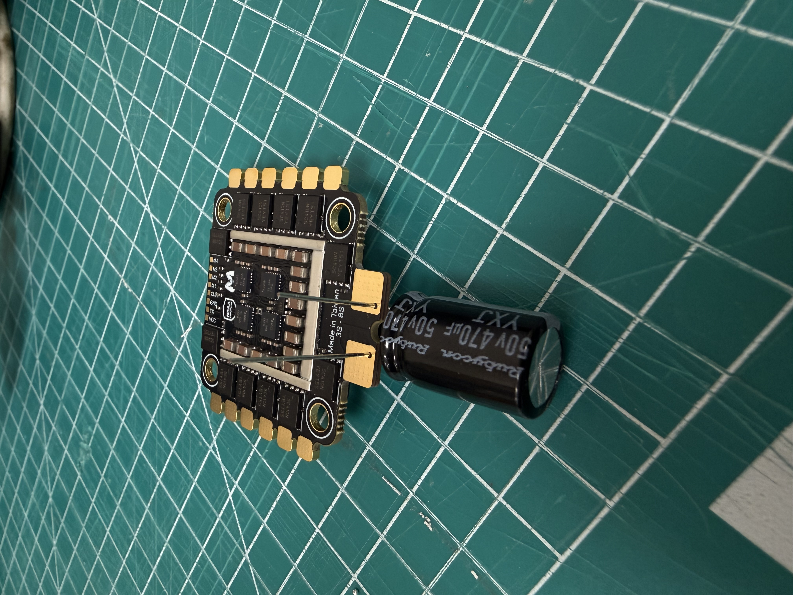
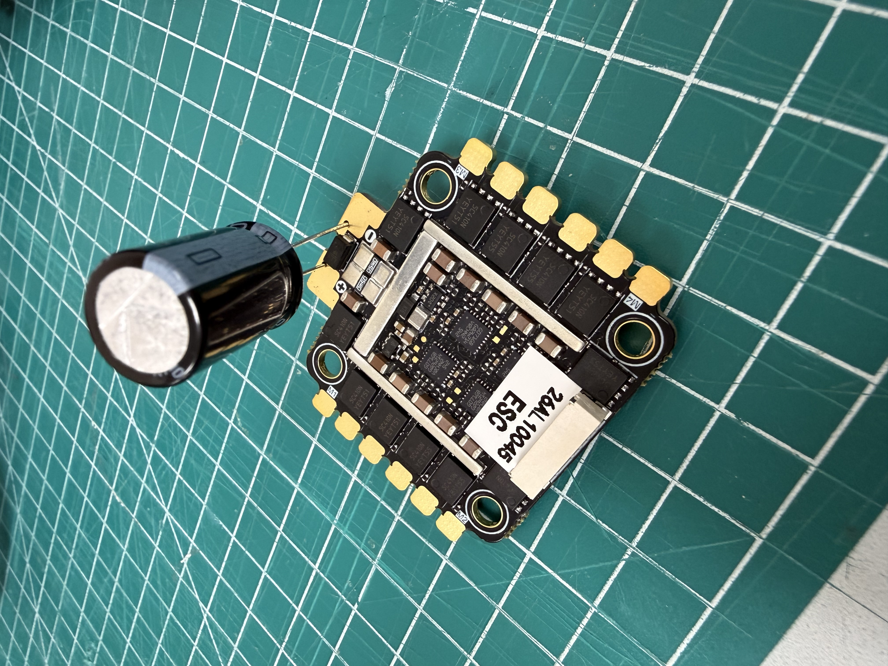
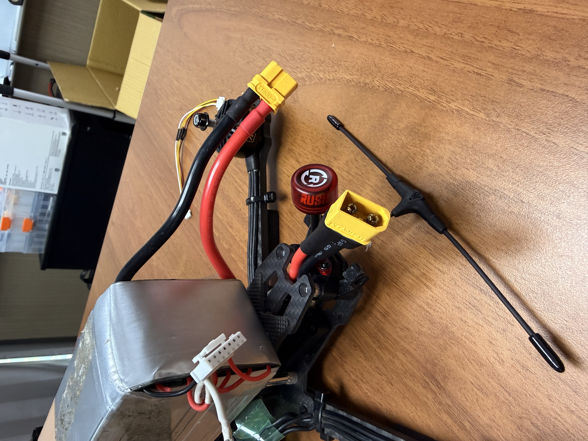
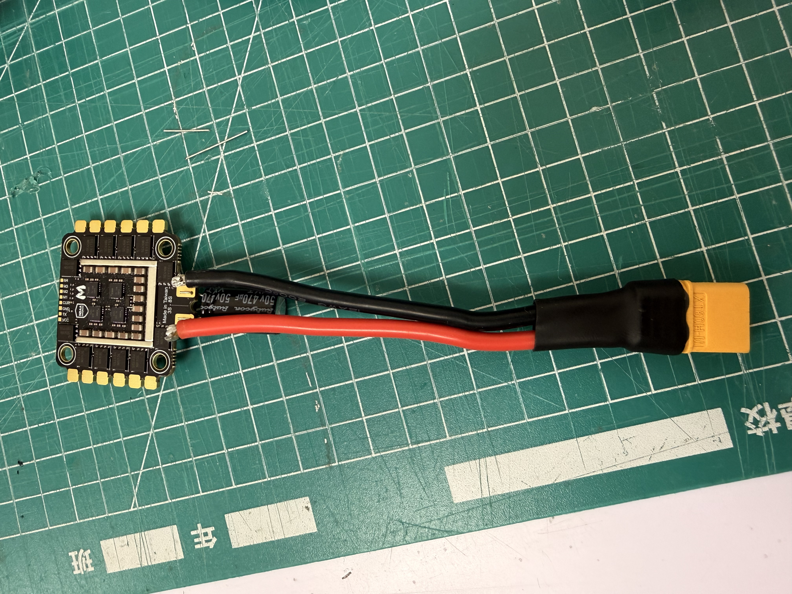
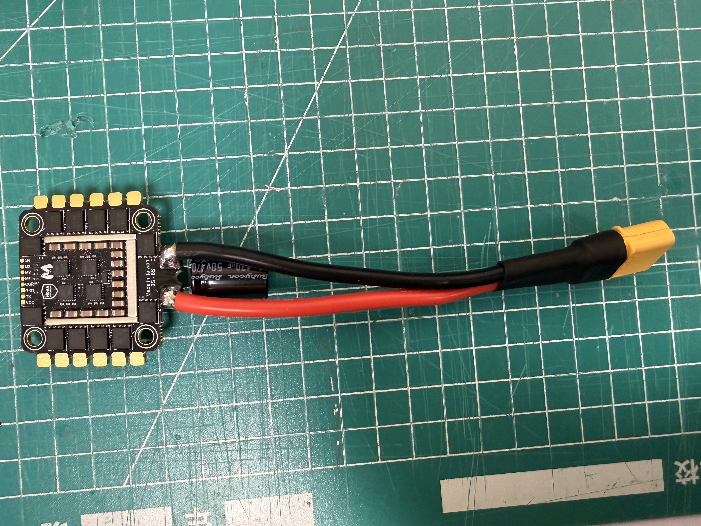
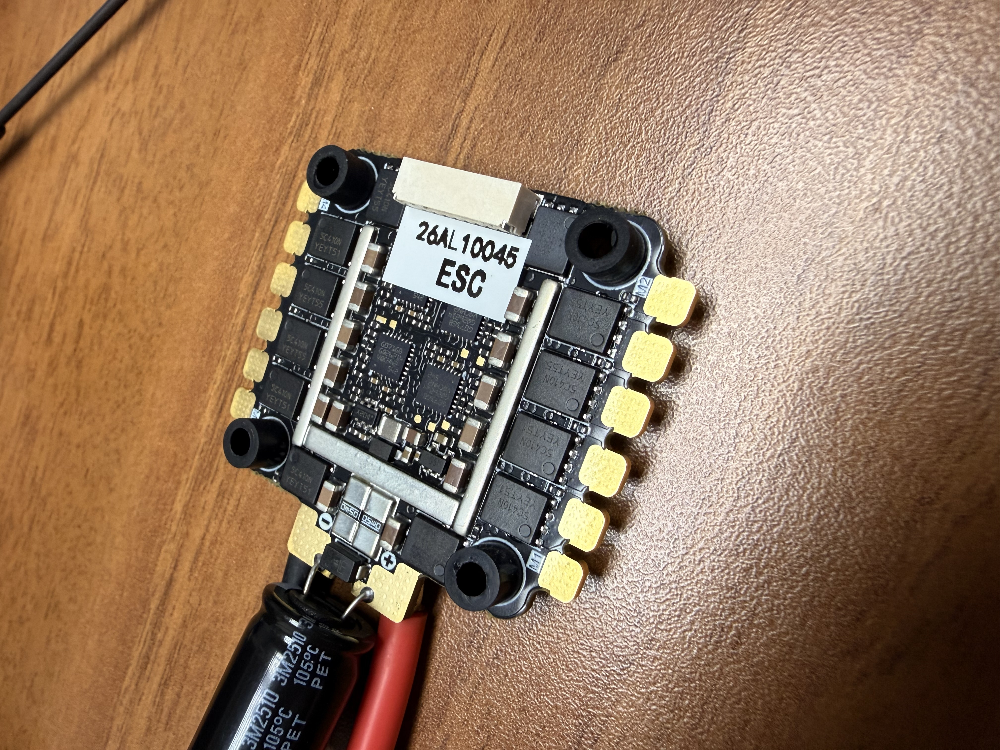
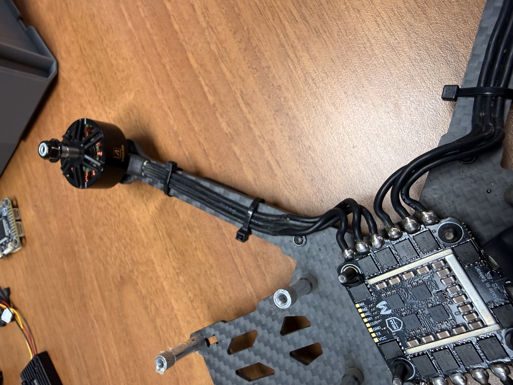

# 安裝電子調速器(ESC)


安裝電子調速器ESC前，確認ESC是否有安裝濾波電容


### 電子調速器ESC安裝濾波電容

濾波電容安裝方式如下：

<figure><figcaption></figcaption></figure>

需要注意濾波電容的**長腳接到正極、短腳接到負極**

<figure><figcaption></figcaption></figure>

### 焊接電源接口(XT60)

安裝前需要確認需要的電源線長度，在**初組裝**時可以先判斷長度需求

<figure><figcaption></figcaption></figure>

確認需要的長度後裁剪指定長度的線材，最好使用電源線（紅色）與地線（黑色）對應的顏色，避免混肴

<figure><figcaption></figcaption></figure>

確認後即可將電容與電源線焊接到ESC上面

<figure><figcaption></figcaption></figure>

安裝減震墊

<figure><figcaption></figcaption></figure>

### 焊接馬達線

ESC是使用三相電輸出給馬達，因此通常馬達會有三相電輸入，依序連接到ESC上

<figure><figcaption></figcaption></figure>
