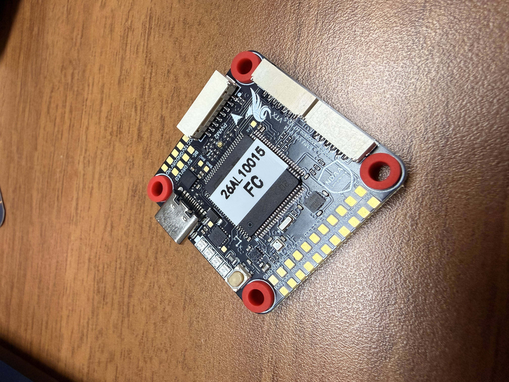
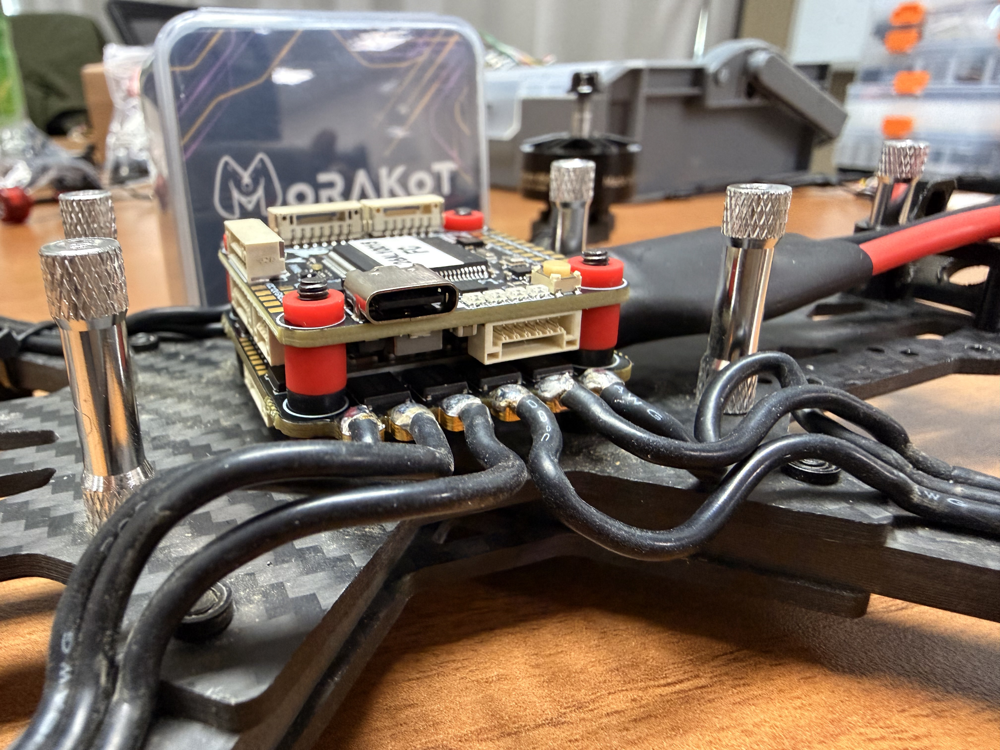
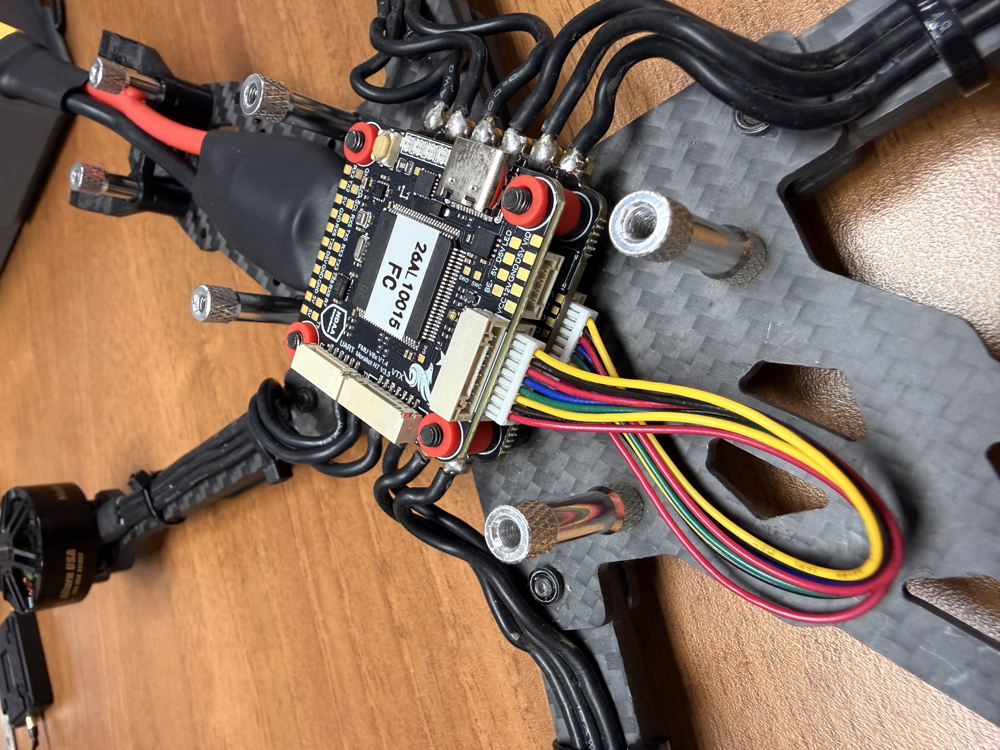
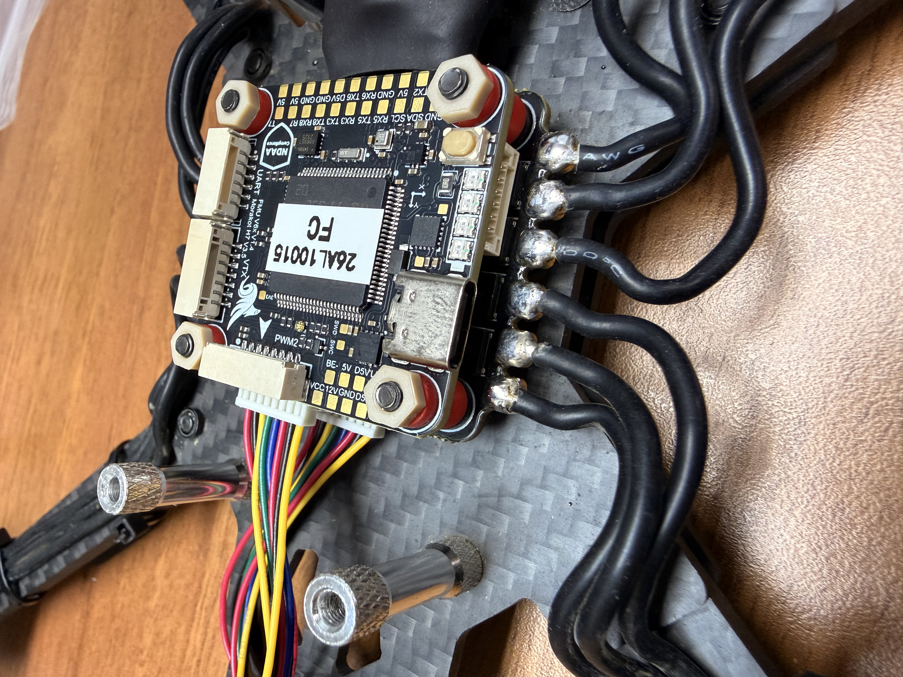

# 安裝飛行控制器(Flight Controller)

安裝飛行控制器(後稱**飛控**)前，需要注意機架的方向，一般來說飛控的方向即為機首，因此飛控的方向通常與機架方向相同

### 安裝減震墊

在飛控的四角空洞處加上減震的橡膠墊

<figure><figcaption></figcaption></figure>

### 安裝飛控

飛控跟ESC最好可以留5mm左右的距離，避免飛控上面的Compass被ESC的強力磁場所干擾

<figure><figcaption></figcaption></figure>

### 接線

飛控的電源來自ESC，因此將ESC連接到飛控的**PWM1接口**

<figure><figcaption></figcaption></figure>

### 安裝固定螺母

在固定柱最上面安裝**固定螺母**，為減震墊增加下壓力，並避免飛塔鬆脫

<figure><figcaption></figcaption></figure>

