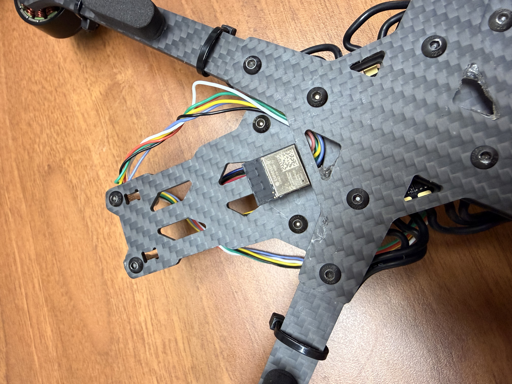
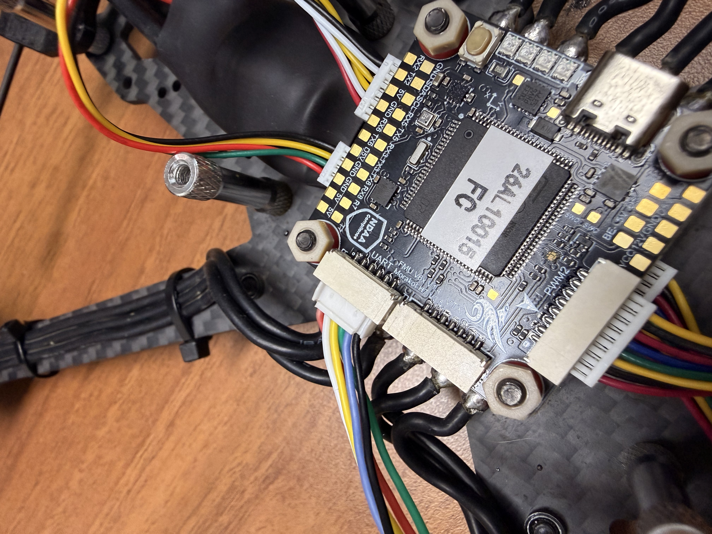

# 安裝數傳模組(Telemetry)

### 接線

將數傳模組連接到飛控的**UART接口**

<figure><figcaption></figcaption></figure>

### 安裝

將**數傳模組**固定在機架上

<figure><figcaption></figcaption></figure>

連接到飛控的**UART接口**

<figure><figcaption></figcaption></figure>
