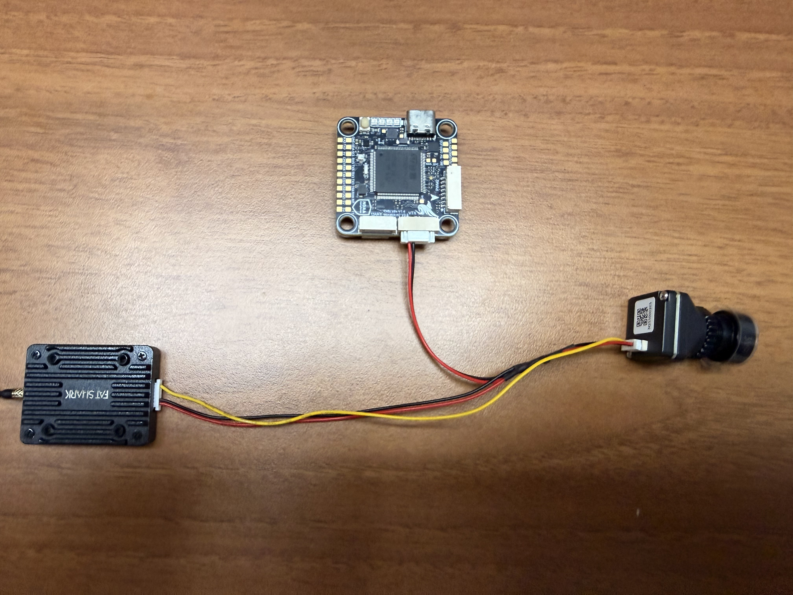
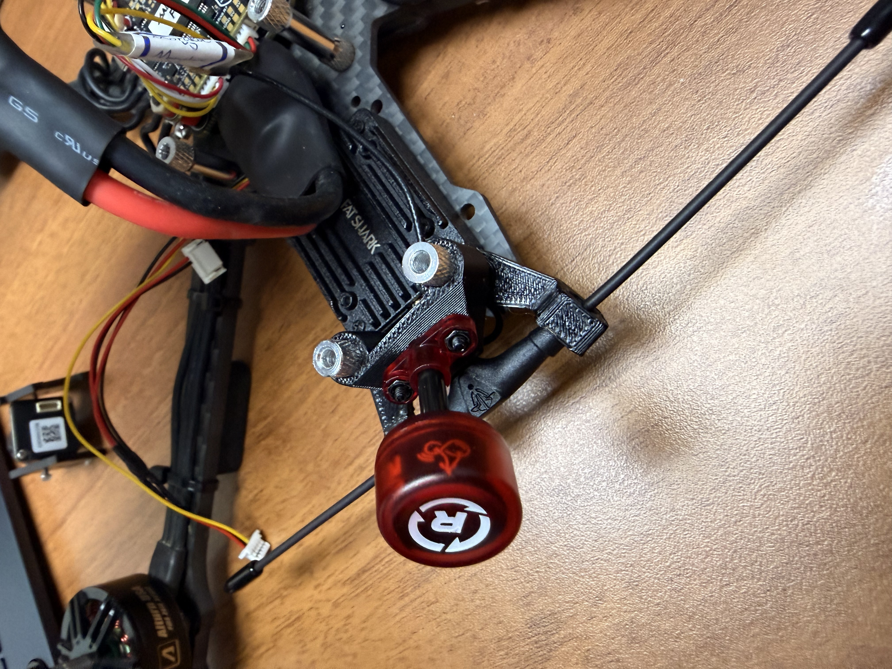
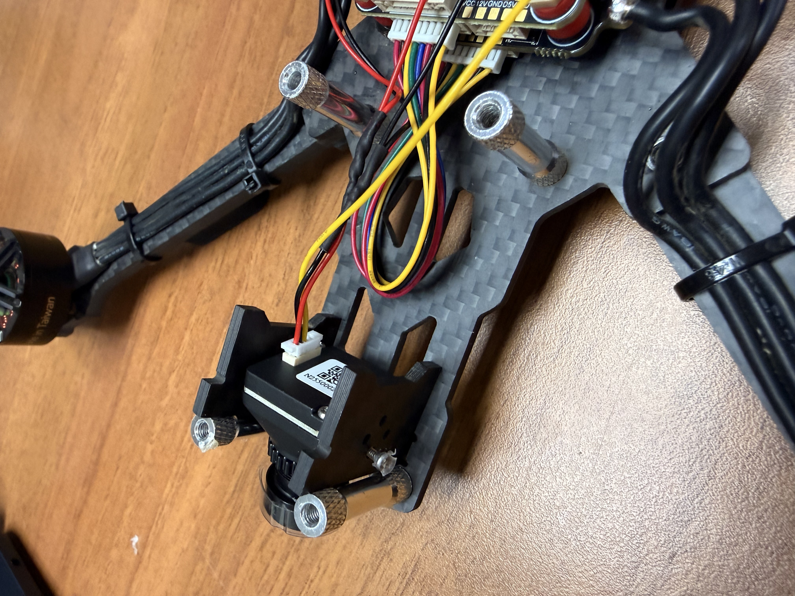

# 安裝圖傳模組(VTX)

圖傳模組與飛控、鏡頭接線方法

### 接線：類比圖傳

#### 方法一：Video直通圖傳模組VTX

<figure><figcaption></figcaption></figure>

紅色：電源線(12V)

黑色：地線(GND)

黃色：Video

#### 方法二：Video經過飛控連接到VTX

### 接線：數位圖傳

以DJI o4 Pro為例，內容待補

### 安裝

安裝圖傳模組(VTX)

<figure><figcaption></figcaption></figure>

連接到鏡頭

<figure><figcaption></figcaption></figure>
