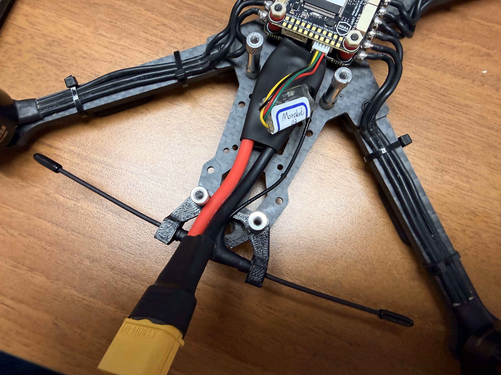

# 安裝遙控器接收機(RC Receiver)


安裝前需要注意是否會被螺旋槳打到，如果有風險則可以黏在機架上，或是以3D列印零件加以固定


### 接線

將遙控器接收機模組連接到飛控的**RC接口**

<figure><figcaption></figcaption></figure>

### 安裝

將**遙控器接收機**固定在機架上

<figure><figcaption></figcaption></figure>
