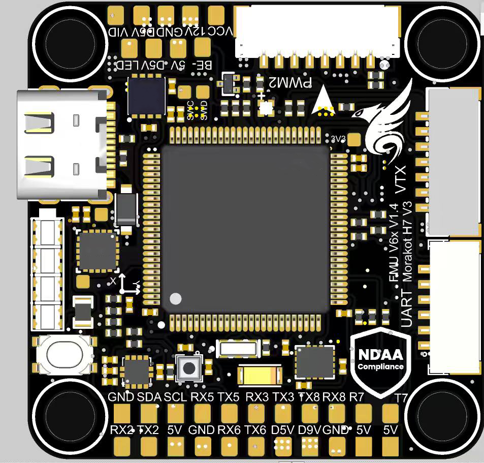
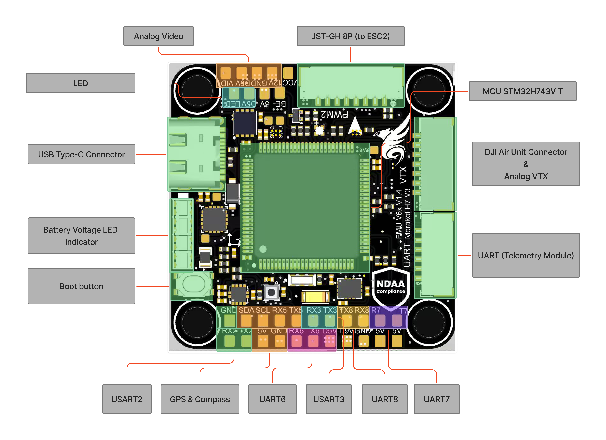
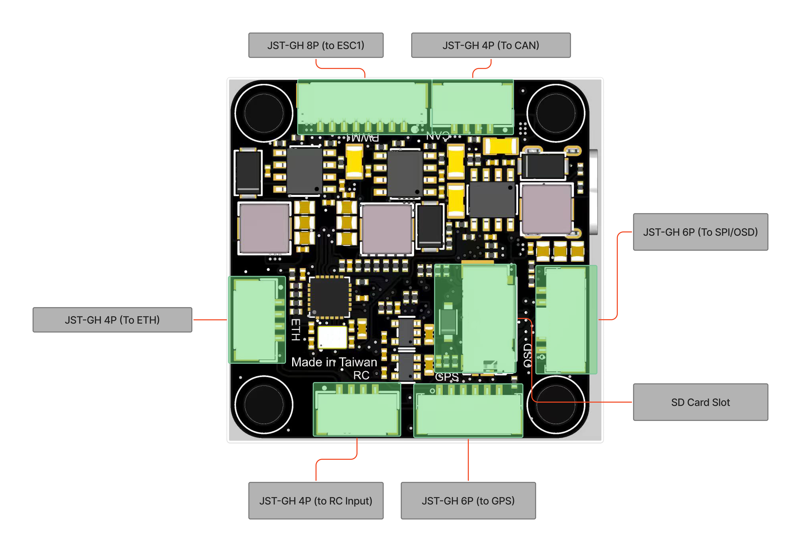

# Morakot Flight Controller

<figure><figcaption></figcaption></figure>


## **規格** Specifications

* **微處理器 Microprocessor**
  * STM32H743VIT MCU
* **感測器 Sensors**
  * ICM-45686 High-Performance IMU
  * Bosch BMP390 Barometer
  * ST IIS2MDCTR Magnetometer
* **電源系統 Power**
  * 3S–8S DC Input power
  * 5V周邊設備電源輸出 BEC peripherals power&#x20;
  * 9V周邊設備伺服輸出 BEC servos power&#x20;
  * 12V影像設備電源輸出 BEC video power
* **介面 Interfaces**
  * 8x UART
  * 8x PWM
  * 1x I2C
  * 1x CAN
  * 1x OSD(SPI)
  * 1x USB Type-C Connector
  * 1x Ethernet
  * 1x MicroSD Slot
  * LED電量指示燈 Battery Voltage LED Indicator
  * DFU啟動按鍵 Boot button
  * 支援類比圖傳 Analog video support

## **接腳定義 Pinout**


<figure><figcaption></figcaption></figure>

<figure><figcaption></figcaption></figure>


## **連接器接腳分配 Connectors Pin A**ssignments

**PWM1(JST-GH 8p)**

| Pin | Signal   | Voltage     |
| --- | -------- | ----------- |
| 1   | VCC      | +12V\~33.6V |
| 2   | UART7 RX | +3.3V       |
| 3   | GND      |             |
| 4   | CURRENT  |             |
| 5   | Motor1   |             |
| 6   | Motor2   |             |
| 7   | Motor3   |             |
| 8   | Motor4   |             |

**PWM2(JST-GH 8p)**

| Pin | Signal   | Voltage     |
| --- | -------- | ----------- |
| 1   | VCC      | +12V\~33.6V |
| 2   | UART6 RX | +3.3V       |
| 3   | GND      |             |
| 4   | CURRENT  |             |
| 5   | Motor5   |             |
| 6   | Motor6   |             |
| 7   | Motor7   |             |
| 8   | Motor8   |             |

**VTX(JST-GH 7p)**

| Pin | Signal    | Voltage    |
| --- | --------- | ---------- |
| 1   | Video     |            |
| 2   | VCC       | +12\~33.6V |
| 3   | GND       |            |
| 4   | USART1 RX | +3.3V      |
| 5   | USART1 TX | +3.3V      |
| 6   | GND       |            |
| 7   | USART3 RX | +3.3V      |

**UART(JST-GH 6p)**

| Pin | Signal    | Voltage |
| --- | --------- | ------- |
| 1   | VCC       | +5V     |
| 2   | UART7 TX  | +3.3V   |
| 3   | UART7 RX  | +3.3V   |
| 4   | UART7 CTS |         |
| 5   | UART7 RTS |         |
| 6   | GND       |         |

**GPS(JST-GH 6p)**

| Pin | Signal   | Voltage |
| --- | -------- | ------- |
| 1   | VCC      | +5V     |
| 2   | UART5 TX | +3.3V   |
| 3   | UART5 RX | +3.3V   |
| 4   | SCL      |         |
| 5   | SDA      |         |
| 6   | GND      |         |

**OSD(JST-GH 6p)**

| Pin | Signal    | Voltage |
| --- | --------- | ------- |
| 1   | VCC       | +5V     |
| 2   | SPI4 MOSI |         |
| 3   | SPI4 MISO |         |
| 4   | SPI4 SCK  |         |
| 5   | OSD CS    |         |
| 6   | GND       |         |

**CAN(JST-GH 4p)**

| Pin | Signal | Voltage |
| --- | ------ | ------- |
| 1   | VCC    | +5V     |
| 2   | CAN\_H |         |
| 3   | CAN\_L |         |
| 4   | GND    |         |

**RC Input(JST-GH 4p)**

| Pin | Signal   | Voltage |
| --- | -------- | ------- |
| 1   | VCC      | +5V     |
| 2   | UART8 TX | +3.3V   |
| 3   | UART8 RX | +3.3V   |
| 4   | GND      |         |

**ETH(JST-GH 4p)**

| Pin | Signal | Voltage |
| --- | ------ | ------- |
| 1   | TXP    |         |
| 2   | TXN    |         |
| 3   | RXP    |         |
| 4   | RXN    |         |


## **UART接口定義 Serial Port Mapping**

<table><thead><tr><th width="145">Serial Number</th><th width="130">UART</th><th width="186">Port</th><th>Ardupilot Parameters</th></tr></thead><tbody><tr><td>Serial0</td><td>OTG1</td><td>USB Type-C</td><td>SERIAL0_BAUD,115
<br>SERIAL0_PROTOCOL,2
</td></tr><tr><td>Serial1</td><td>USART1</td><td>VTX<br>(compatible with DJI)</td><td>SERIAL1_BAUD,115
<br>SERIAL1_OPTIONS,0
<br>SERIAL1_PROTOCOL,42
<br>DMA-enabled</td></tr><tr><td>Serial2</td><td>USART2</td><td>Telem(UART)</td><td>SERIAL2_BAUD,57
<br>SERIAL2_OPTIONS,0
<br>SERIAL2_PROTOCOL,2
<br>DMA-enable</td></tr><tr><td>Serial3</td><td>USART3</td><td>S.BUS</td><td>SERIAL3_OPTIONS,1
<br>SERIAL3_PROTOCOL,23
<br>DMA-enabled</td></tr><tr><td>Serial4</td><td>UART5</td><td>GPS</td><td>SERIAL4_BAUD,230 SERIAL4_OPTIONS,0 SERIAL4_PROTOCOL,5</td></tr><tr><td>Serial5</td><td>USART6</td><td>ESC2</td><td>SERIAL5_BAUD,115
<br>SERIAL5_OPTIONS,0
<br>SERIAL5_PROTOCOL,2
<br>DMA-enabled</td></tr><tr><td>Serial6</td><td>UART7</td><td>Telem(UART) / ESC1</td><td>SERIAL6_BAUD,115
<br>SERIAL6_OPTIONS,0
<br>SERIAL6_PROTOCOL,2
<br>DMA-enabled</td></tr><tr><td>Serial7</td><td>UART8</td><td>RC Input</td><td>SERIAL7_OPTIONS,0
<br>SERIAL7_PROTOCOL,23
<br>DMA-enabled</td></tr></tbody></table>

## **遙控器輸入 RC Input**

RC input經由UART介面輸入遙控訊號，支援CSRF、ELRS、S.BUS訊號。

### Ardupilot

在Ardupilot中需要設定以下參數：

SERIAL7\_OPTIONS,0 \
SERIAL7\_PROTOCOL,23

需要注意是否在Serial port同時開啟VTX的S.BUS設定，Ardupilot(4.7.0)目前在Serial port中僅支援一個RC input功能，如果同時在Serial Port設定兩個RC input，Ardupilot會出現錯誤，請根據您的需求進行設定：



```
# 關閉RC input的Serial7設定
SERIAL7_BAUD,115
SERIAL7_OPTIONS,0
SERIAL7_PROTOCOL,-1

# 開啟VTX的Serial3設定(CSRF、ELRS)
SERIAL3_BAUD,115
SERIAL3_OPTIONS,0
SERIAL3_PROTOCOL,-1

# 開啟VTX的Serial3設定(S.BUS)
SERIAL3_BAUD,115
SERIAL3_OPTIONS,1
SERIAL3_PROTOCOL,23
```



```
# 關閉VTX的Serial3設定
SERIAL3_BAUD,115
SERIAL3_OPTIONS,0
SERIAL3_PROTOCOL,-1

# 開啟RC input的Serial7設定(CSRF、ELRS)
SERIAL7_BAUD,115
SERIAL7_OPTIONS,0
SERIAL7_PROTOCOL,23
```



### Betaflight

使用VTX介面的RX作為RC input

<figure><figcaption></figcaption></figure>

## **網路設定  Ethernet**

```
# 目前支援Ardupilot網路功能

# Define ethernet settings
NET_DHCP 0
NET_ENABLE 1
NET_GWADDR0 192
NET_GWADDR1 168
NET_GWADDR2 1
NET_GWADDR3 1
NET_IPADDR0 192
NET_IPADDR1 168
NET_IPADDR2 1
NET_IPADDR3 21
NET_NETMASK,24
NET_OPTIONS,0
NET_P1_IP0,255
NET_P1_IP1,255
NET_P1_IP2,255
NET_P1_IP3,255
NET_P1_PORT,14550
NET_P1_PROTOCOL,2
NET_P1_TYPE,1
NET_P2_TYPE,0
NET_P3_TYPE,0
NET_P4_TYPE,0
```

## **CAN 設定**

```
# 目前支援Ardupilot CAN bus功能
CAN_P1_DRIVER,1
CAN_D1_PROTOCOL,1
```

